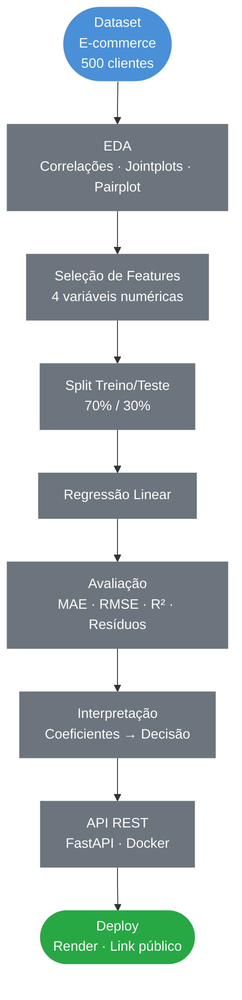
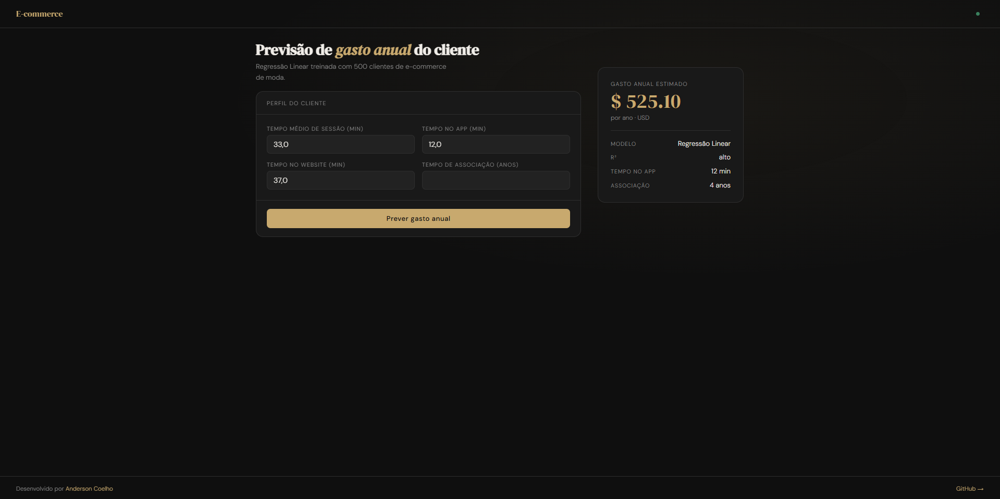
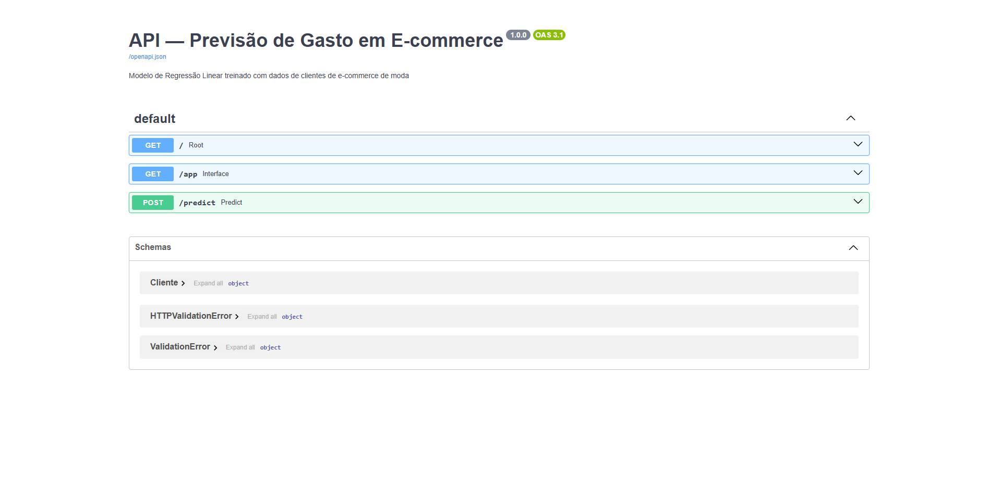

# Regressão Linear em Dados de E-Commerce

### EDA · Regressão Linear · Interpretação de Coeficientes · FastAPI · Docker · Deploy

&nbsp;

[](https://www.python.org/)
[](https://scikit-learn.org/)
[](https://fastapi.tiangolo.com/)
[](https://www.docker.com/)
[](https://api-ecommerce-ml.onrender.com)

&nbsp;
> Modelo de Regressão Linear para identificar quais canais e comportamentos mais influenciam
> o gasto anual dos clientes de uma empresa de moda online apoiando a decisão de investimento
> entre app mobile e website. Deploy em produção com API REST containerizada.

&nbsp;

### Interface Interativa

**[Acessar interface interativa](https://api-ecommerce-ml.onrender.com/app)** &nbsp;|&nbsp; **[Documentação da API](https://api-ecommerce-ml.onrender.com/docs)**

---


## Índice

- [Contexto](#contexto)
- [Objetivos](#objetivos)
- [Pipeline do Projeto](#pipeline-do-projeto)
- [Tecnologias](#tecnologias-utilizadas)
- [Dataset](#dataset)
- [Análise Exploratória](#análise-exploratória)
- [Resultados do Modelo](#resultados-do-modelo)
- [Decisão de Negócio](#decisão-de-negócio)
- [API em Produção](#api-em-produção)
- [Estrutura do Repositório](#estrutura-do-repositório)
- [Autor](#autor)

---

## Contexto

Projeto de Regressão Linear aplicado ao e-commerce de moda. Uma empresa de Nova York vende roupas online e oferece sessões de consultoria presencial de estilo. A gestão precisa decidir onde concentrar os investimentos: no **aplicativo mobile** ou no **website**. O modelo identifica quais fatores mais impactam o gasto anual dos clientes e apoia essa decisão estratégica.

| Etapa | Descrição |
|---|---|
| **EDA** | Análise de correlação entre canais de acesso e gasto anual |
| **Modelagem** | Regressão Linear com 4 features numéricas |
| **Avaliação** | MAE, MSE, RMSE, R² e análise de resíduos |
| **Decisão** | Interpretação dos coeficientes para apoio estratégico |
| **Deploy** | API REST com FastAPI + Docker + Render |

> **Base de dados fictícia** criada para fins educacionais.

---

## Objetivos

- Construir um modelo de regressão para prever o gasto anual dos clientes
- Identificar quais variáveis mais influenciam o volume de compras
- Interpretar os coeficientes do modelo para apoiar a decisão de negócio
- Criar uma API REST com FastAPI e containerizar com Docker
- Fazer deploy em produção com link público acessível

---

## Pipeline do Projeto



---

## Tecnologias Utilizadas

| Tecnologia | Uso no Projeto |
|---|---|
|  | Linguagem principal |
|  | Manipulação e análise dos dados |
|  | Operações numéricas |
|  | Modelo de Regressão Linear e métricas |
|  | Scatter plots e visualizações |
|  | Jointplots, pairplot e lmplot |
|  | API REST para servir o modelo em produção |
|  | Containerização da aplicação |
|  | Hospedagem do deploy em produção |

---

## Dataset

**Fonte:** Dataset fictício de e-commerce criado para fins educacionais
**Uso:** Exclusivamente educacional

| Característica | Detalhe |
|---|---|
| Volume | 500 clientes |
| Variável target | `Yearly Amount Spent` (USD) |

**Variáveis utilizadas:**

| Variável | Descrição |
|---|---|
| `Avg. Session Length` | Tempo médio de sessão de consultoria na loja (min) |
| `Time on App` | Tempo médio no aplicativo mobile (min) |
| `Time on Website` | Tempo médio no website (min) |
| `Length of Membership` | Tempo de associação como cliente (anos) |
| `Yearly Amount Spent` | **Target** gasto anual do cliente (USD) |

---

## Análise Exploratória

### Valores Reais vs Previstos


> Pontos próximos à linha diagonal indicam boa aderência do modelo a Regressão Linear capturou bem a relação entre as variáveis comportamentais e o gasto anual.

### Análise de Resíduos


> Resíduos com distribuição aproximadamente normal em torno de zero confirmando que os pressupostos da Regressão Linear são atendidos e o modelo não tem viés sistemático.

### Impacto de Cada Variável no Gasto Anual


> Cada barra representa o impacto de 1 unidade adicional da variável no gasto anual em USD. `Length of Membership` e `Time on App` são os fatores de maior peso, enquanto `Time on Website` tem impacto praticamente nulo.

---

## Resultados do Modelo

### Coeficientes do Modelo

| Variável | Coeficiente | Interpretação |
|---|---|---|
| **Length of Membership** | **~$61** | **1 ano a mais de associação → +$61/ano** |
| **Time on App** | **~$39** | **1 min a mais no app → +$39/ano** |
| Avg. Session Length | ~$26 | 1 min a mais na sessão → +$26/ano |
| Time on Website | ~$0.19 | impacto praticamente nulo |

### Métricas de Avaliação

| Métrica | Valor |
|---|---|
| MAE | ~$7.23 |
| MSE | ~$79.81 |
| RMSE | ~$8.93 |

---

## Decisão de Negócio

A interpretação dos coeficientes revela dois insights estratégicos claros:

**1. Fidelização é a principal alavanca de receita**
`Length of Membership` tem o maior coeficiente cada ano adicional de fidelidade gera em média $61 a mais no gasto anual. A empresa deve priorizar **programas de fidelização e retenção** antes de qualquer investimento em canal.

**2. App mobile supera o website**
O coeficiente do `Time on App` (~$39) é muito superior ao do `Time on Website` (~$0.19). Investir em melhorias no aplicativo tem retorno claramente mensurável, enquanto o website apresenta impacto desprezível no gasto dos clientes.

---

## API em Produção

### Interface Interativa

[](https://api-ecommerce-ml.onrender.com/app)

> Acesse a interface em: **[api-ecommerce-ml.onrender.com/app](https://api-ecommerce-ml.onrender.com/app)**

### Documentação Swagger

[](https://api-ecommerce-ml.onrender.com/docs)

> Documentação completa da API em: **[api-ecommerce-ml.onrender.com/docs](https://api-ecommerce-ml.onrender.com/docs)**

### Exemplo de Requisição

```bash
curl -X POST https://api-ecommerce-ml.onrender.com/predict \
  -H "Content-Type: application/json" \
  -d '{
    "avg_session_length": 33.0,
    "time_on_app": 12.0,
    "time_on_website": 37.0,
    "length_of_membership": 4.0
  }'
```

### Resposta

```json
{
  "gasto_anual_previsto": 498.32,
  "unidade": "USD",
  "modelo": "LinearRegression"
}
```

### Endpoints disponíveis

| Método | Endpoint | Descrição |
|---|---|---|
| `GET` | `/` | Status da API |
| `GET` | `/app` | Interface interativa |
| `GET` | `/docs` | Documentação Swagger |
| `POST` | `/predict` | Previsão de gasto anual |

---

## Estrutura do Repositório

```
Regressao-Linear-em-dados-de-e-commerce/
│
├──  assets/                                          # Gráficos e imagens
│   ├── real_vs_previsto_ecommerce.png
│   ├── residuos_ecommerce.png
│   ├── coeficientes_ecommerce.png
│   ├── modelo_em_funcionamento.png
│   └── Swagger_UI.png
│
├──  regressao_linear_em_dados_de_ecommerce.ipynb    # Notebook completo
├──  main.py                                          # API FastAPI
├──  index.html                                       # Interface interativa
├──  Dockerfile                                       # Containerização
├──  modelo_ecommerce.pkl                             # Modelo treinado
├──  colunas_ecommerce.pkl                            # Features esperadas pela API
├──  ecommerce-customers.csv                          # Dataset original
├──  requirements.txt                                 # Dependências do projeto
└──  README.md                                        # Documentação do projeto
```

---

## Autor

<div align="center">


**Anderson Coelho**
*Cientista de Dados*

[](https://www.linkedin.com/in/anderson-coelho-42671634a/)
[](https://github.com/Anderson1999DC)

</div>

---

<div align="center">
