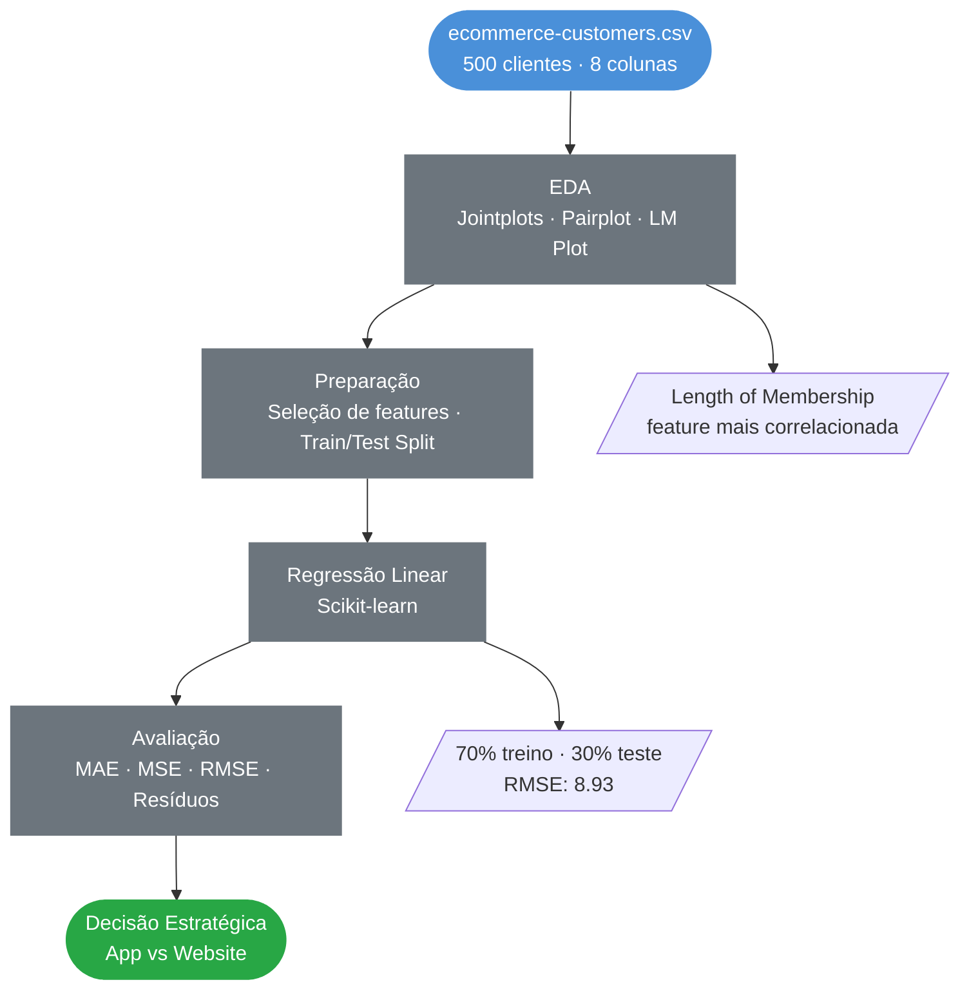
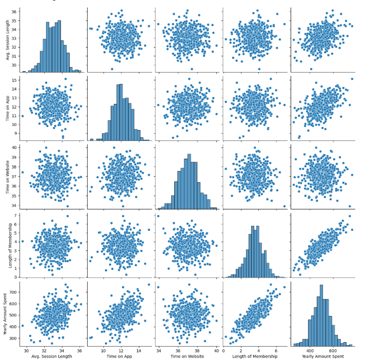
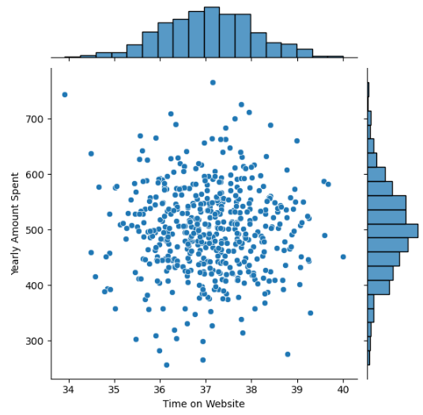
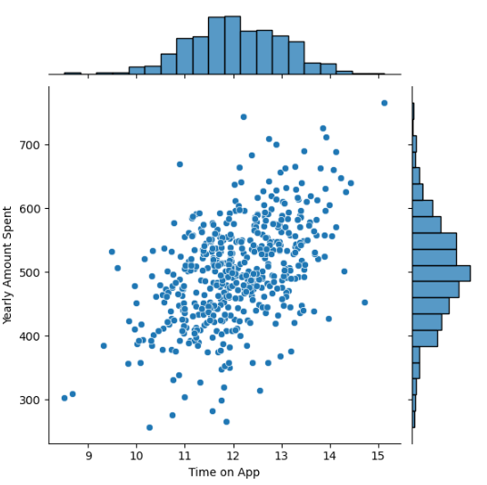
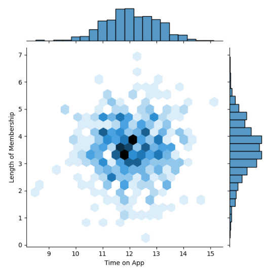
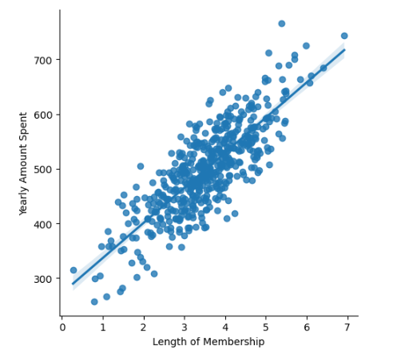
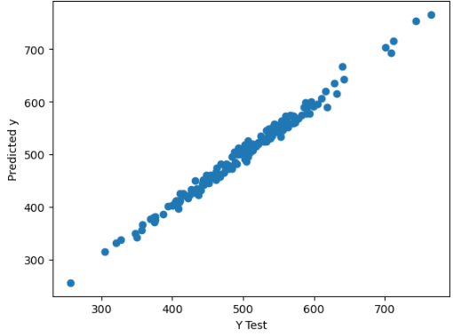
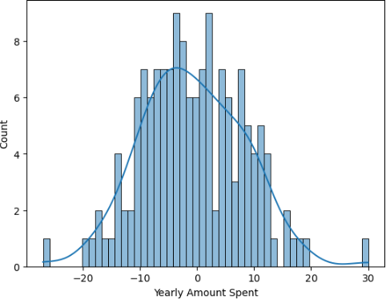

<div align="center">

# Regressão Linear em Dados de E-commerce
### EDA · Regressão Linear · Análise de Coeficientes · Decisão Estratégica

<br>

[](https://www.python.org/)
[](https://pandas.pydata.org/)
[](https://scikit-learn.org/)
[](https://seaborn.pydata.org/)
[]()

<br>

> Aplicação de Regressão Linear para prever o valor anual gasto por clientes em uma plataforma
> de e-commerce, com foco em responder uma pergunta estratégica de negócio: **app ou website?**

</div>

---

## Índice

- [Contexto](#contexto)
- [Objetivos](#objetivos)
- [Pipeline do Projeto](#pipeline-do-projeto)
- [Tecnologias](#tecnologias-utilizadas)
- [Dataset](#dataset)
- [Análise Exploratória](#análise-exploratória)
- [Modelagem e Resultados](#modelagem-e-resultados)
- [Conclusão Estratégica](#conclusão-estratégica)
- [Estrutura do Repositório](#estrutura-do-repositório)
- [Autor](#autor)

---

## Contexto

Uma empresa de e-commerce com sede em Nova York vende roupas online e também oferece sessões de consultoria de estilo presencialmente. Os clientes podem interagir com a empresa tanto pelo **aplicativo mobile** quanto pelo **website**.

A empresa precisa tomar uma decisão estratégica:

> **Vale mais a pena investir no aplicativo mobile ou no website para aumentar o faturamento?**

Atuei como Cientista de Dados para responder essa pergunta com base em dados reais de comportamento dos clientes.

| Canal | Situação Observada |
|---|---|
| **Aplicativo Mobile** | Forte correlação com o valor gasto |
| **Website** | Correlação praticamente nula com o valor gasto |

---

## Objetivos

- Explorar as relações entre comportamento dos clientes e valor gasto anualmente
- Identificar quais variáveis mais influenciam o faturamento
- Construir e avaliar um modelo de Regressão Linear para previsão do gasto anual
- Traduzir os coeficientes do modelo em recomendações de negócio

---

## Pipeline do Projeto



---

## Tecnologias Utilizadas

| Tecnologia | Uso no Projeto |
|---|---|
|  | Linguagem principal |
|  | Manipulação e análise dos dados |
|  | Cálculos numéricos e métricas |
|  | Scatter plot de avaliação |
|  | Jointplots, Pairplot e análise de resíduos |
|  | Modelo de Regressão Linear e métricas |

---

## Dataset

**Fonte:** `ecommerce-customers.csv` — Dataset público de comportamento de clientes
**Uso:** Exclusivamente educacional

| Característica | Detalhe |
|---|---|
| Volume | 500 clientes |
| Colunas totais | 8 |
| Features usadas no modelo | 4 |
| Variável alvo | `Yearly Amount Spent` |

**Variáveis do modelo:**

| Feature | Descrição | Média |
|---|---|---|
| `Avg. Session Length` | Duração média das sessões de consultoria | 33,05 min |
| `Time on App` | Tempo médio no aplicativo mobile | 12,05 min |
| `Time on Website` | Tempo médio no website | 37,06 min |
| `Length of Membership` | Tempo de associação do cliente | 3,53 anos |
| `Yearly Amount Spent` | **Variável alvo** — valor gasto no ano | **US$ 499,31** |

---

## Análise Exploratória

### Visão Geral das Relações entre Variáveis



> A análise do pairplot revela claramente que **`Length of Membership`** é a feature com maior correlação visual com o valor gasto anual, seguida por **`Time on App`**. `Time on Website` praticamente não apresenta padrão linear.

---

### Tempo no website × Valor Gasto Anual



> Distribuição dispersa sem tendência linear — o tempo no website **não tem relação significativa** com o quanto o cliente gasta.

---

### Tempo no Aplicativo × Valor Gasto Anual



> Correlação positiva moderada visível — clientes que passam mais tempo no app tendem a gastar mais.

---

### Tempo no Aplicativo × Tempo de Associação



> Padrão hexagonal mostrando a concentração dos clientes — a maioria usa o app entre 11–13 min e tem entre 2–5 anos de associação.

---

### Relação Linear — Tempo de Associação × Valor Gasto



> **Relação linear mais forte do dataset.** Clientes com mais tempo de associação gastam consistentemente mais — o que aponta para fidelização como principal alavanca de receita.

---

## Modelagem e Resultados

### Performance do Modelo — Dados de Teste

### Valores Reais vs. Preditos



> Pontos concentrados próximos à diagonal, confirmando que o modelo captura bem a variação do gasto. Sem padrões sistemáticos de erro.

### Análise de Resíduos



> Resíduos com distribuição aproximadamente normal e centrada em zero — sem viés sistemático, confirmando que a Regressão Linear é adequada para esse problema.

### Métricas de Avaliação

| Métrica | Valor |
|---|---|
| MAE | **US$ 7,23** |
| MSE | 79,81 |
| **RMSE** | **US$ 8,93** |

> Com RMSE de apenas **US$ 8,93** em um valor médio de **US$ 499**, o modelo apresenta erro relativo de menos de 2% — excelente desempenho para uma Regressão Linear simples.

### Coeficientes do Modelo

| Feature | Coeficiente | Interpretação |
|---|---|---|
| `Length of Membership` | **+61,28** | Cada ano a mais de associação → +US$ 61 gastos/ano |
| `Time on App` | **+38,59** | Cada minuto a mais no app → +US$ 38,59 gastos/ano |
| `Avg. Session Length` | +25,98 | Cada minuto a mais em consultoria → +US$ 25,98 gastos/ano |
| `Time on Website` | +0,19 | Impacto praticamente nulo no valor gasto |

---

## Conclusão Estratégica

A análise dos coeficientes responde diretamente a pergunta de negócio:

> **O aplicativo mobile tem impacto ~203x maior no faturamento do que o website** (coef. 38,59 vs. 0,19).

No entanto, a variável com maior influência é **`Length of Membership`** (coef. 61,28), o que revela que **fidelizar clientes é mais lucrativo do que qualquer canal digital**.

A empresa tem duas estratégias possíveis:

- **Investir no App** — capitalizar em algo que já funciona e aumentar o engajamento mobile
- **Investir no Website** — tentar desenvolver um canal que hoje está subutilizado e pode crescer

Em ambos os casos, **programas de fidelização** devem ser a prioridade, dado o peso do tempo de associação no modelo.

### Próximos Passos Sugeridos

- Testar modelos não-lineares (Random Forest, XGBoost) para verificar se capturam mais padrões
- Coletar dados de frequência de compra e ticket médio por sessão
- Implementar análise de segmentação (clustering) para personalizar estratégias por perfil de cliente

---

## Estrutura do Repositório

```
Regressao-Linear-em-dados-de-e-commerce/
│
├── 📁 assets/                              # Gráficos gerados na análise
│   ├── pairplot_variaveis.png
│   ├── Time_on_Website_x_Gasto.png
│   ├── time_on_app_x_gasto.png
│   ├── Time_on_App_x_Membership.png
│   ├── lmplot_membership_gasto.png
│   ├── scatter_real_vs_predito.png
│   └── histograma_residuos.png
│
├── 📓 regressao_linear_em_dados_de_ecommerce.ipynb  # Notebook completo
├── 📄 ecommerce-customers.csv                       # Dataset
├── 📄 requirements.txt                              # Dependências do projeto
└── 📄 README.md                                     # Documentação do projeto
```

---

## Autor

<div align="center">


**Anderson Coelho**
*Cientista de Dados*

[](https://www.linkedin.com/in/anderson-coelho-42671634a/)
[](https://github.com/Anderson1999DC)

</div>

---

<div align="center">

</div>
