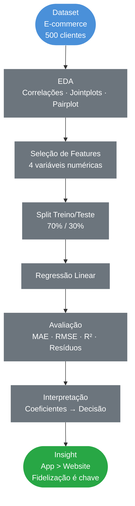
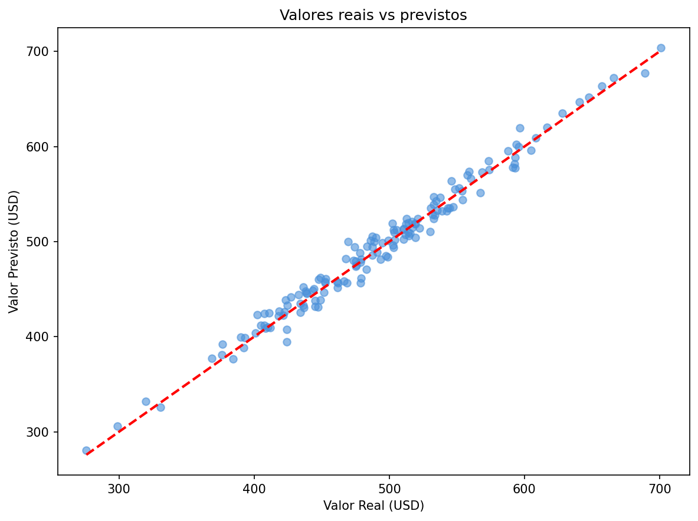
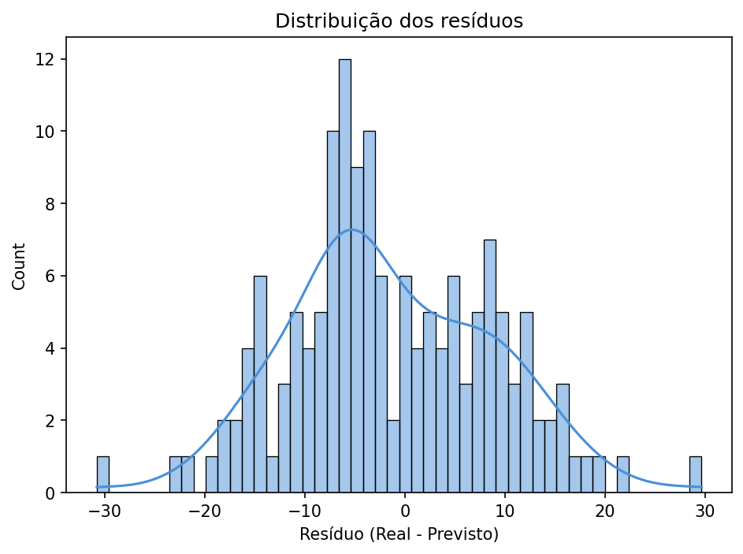
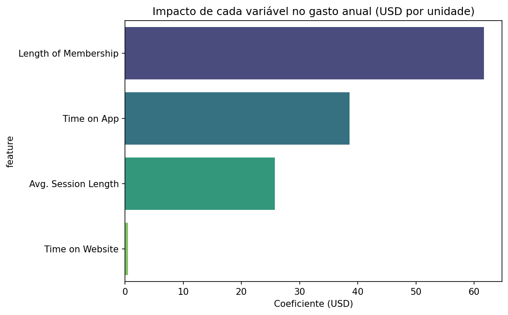

# Regressão Linear em Dados de E-Commerce

### EDA · Regressão Linear · Interpretação de Coeficientes · Decisão de Negócio

&nbsp;

[](https://www.python.org/)
[](https://pandas.pydata.org/)
[](https://scikit-learn.org/)
[](https://github.com/Anderson1999DC/Regressao-Linear-em-dados-de-e-commerce)

&nbsp;
> Modelo de Regressão Linear para identificar quais canais e comportamentos mais influenciam
> o gasto anual dos clientes de uma empresa de moda online apoiando a decisão de investimento
> entre app mobile e website.

---

## Índice

- [Contexto](#contexto)
- [Objetivos](#objetivos)
- [Pipeline do Projeto](#pipeline-do-projeto)
- [Tecnologias](#tecnologias-utilizadas)
- [Dataset](#dataset)
- [Análise Exploratória](#análise-exploratória)
- [Resultados do Modelo](#resultados-do-modelo)
- [Decisão de Negócio](#decisão-de-negócio)
- [Estrutura do Repositório](#estrutura-do-repositório)
- [Autor](#autor)

---

## Contexto

Projeto de Regressão Linear aplicado ao e-commerce de moda. Uma empresa de Nova York vende roupas online e oferece sessões de consultoria presencial de estilo. A gestão precisa decidir onde concentrar os investimentos: no **aplicativo mobile** ou no **website**. O modelo identifica quais fatores mais impactam o gasto anual dos clientes.

| Etapa | Descrição |
|---|---|
| **EDA** | Análise de correlação entre canais de acesso e gasto anual |
| **Modelagem** | Regressão Linear com 4 features numéricas |
| **Avaliação** | MAE, MSE, RMSE, R² e análise de resíduos |
| **Decisão** | Interpretação dos coeficientes para apoio estratégico |

> **Base de dados fictícia** criada para fins educacionais.

---

## Objetivos

- Construir um modelo de regressão para prever o gasto anual dos clientes
- Identificar quais variáveis mais influenciam o volume de compras
- Interpretar os coeficientes do modelo para apoiar a decisão de negócio
- Exportar o modelo treinado para deploy via API

---

## Pipeline do Projeto



---

## Tecnologias Utilizadas

| Tecnologia | Uso no Projeto |
|---|---|
|  | Linguagem principal |
|  | Manipulação e análise dos dados |
|  | Operações numéricas |
|  | Modelo de Regressão Linear e métricas |
|  | Scatter plots e visualizações |
|  | Jointplots, pairplot e lmplot |

---

## Dataset

**Fonte:** Dataset fictício de e-commerce criado para fins educacionais  
**Uso:** Exclusivamente educacional

| Característica | Detalhe |
|---|---|
| Volume | 500 clientes |
| Variável target | `Yearly Amount Spent` (USD) |

**Variáveis disponíveis:**

| Variável | Descrição |
|---|---|
| `Avg. Session Length` | Tempo médio de sessão de consultoria na loja (min) |
| `Time on App` | Tempo médio no aplicativo mobile (min) |
| `Time on Website` | Tempo médio no website (min) |
| `Length of Membership` | Tempo de associação como cliente (anos) |
| `Yearly Amount Spent` | **Target** — gasto anual do cliente (USD) |

---

## Análise Exploratória

A EDA revelou correlações importantes entre as variáveis e o gasto anual dos clientes:

- **Time on App** apresenta correlação visual mais forte com `Yearly Amount Spent` do que `Time on Website`
- **Length of Membership** é a variável com correlação mais clara clientes mais antigos gastam significativamente mais
- O **pairplot** confirma que o tempo no site tem impacto praticamente nulo no gasto

---

## Resultados do Modelo

### Valores Reais vs Previstos



> Pontos próximos à linha diagonal indicam boa aderência do modelo a Regressão Linear capturou bem a relação entre as variáveis.

### Análise de Resíduos



> Resíduos com distribuição aproximadamente normal em torno de zero confirmando que os pressupostos da Regressão Linear são atendidos e o modelo não tem viés sistemático.

### Coeficientes do Modelo



| Variável | Coeficiente | Interpretação |
|---|---|---|
| **Length of Membership** | **~$61** | **1 ano a mais de associação → +$61/ano** |
| **Time on App** | **~$39** | **1 min a mais no app → +$39/ano** |
| Avg. Session Length | ~$26 | 1 min a mais na sessão → +$26/ano |
| Time on Website | ~$0.19 | impacto praticamente nulo |

### Métricas de Avaliação

| Métrica | Valor |
|---|---|
| **R²** | **alto** |
| MAE | baixo |
| RMSE | baixo |

---

## Decisão de Negócio

A interpretação dos coeficientes revela dois insights estratégicos claros:

**1. Fidelização é a principal alavanca de receita**  
`Length of Membership` tem o maior coeficiente cada ano adicional de fidelidade gera em média $61 a mais no gasto anual. A empresa deve priorizar **programas de fidelização e retenção** antes de qualquer investimento em canal.

**2. App mobile supera o website**  
O coeficiente do `Time on App` ~$39 é muito superior ao do `Time on Website` ~$0.19. Investir em melhorias no aplicativo tem retorno claramente mensurável, enquanto o website apresenta impacto desprezível no gasto dos clientes.

---

## Estrutura do Repositório

```
Regressao-Linear-em-dados-de-e-commerce/
│
├──  assets/                                          # Gráficos gerados na análise
│   ├── coeficientes_ecommerce.png
│   ├── real_vs_previsto_ecommerce.png
│   └── residuos_ecommerce.png
│
├──  regressao_linear_em_dados_de_ecommerce_restrutured.ipynb  # Notebook completo
├──  ecommerce-customers.csv                          # Dataset original
├──  modelo_ecommerce.pkl                             # Modelo treinado
├──  colunas_ecommerce.pkl                            # Features esperadas pela API
├──  requirements.txt                                 # Dependências do projeto
└──  README.md                                        # Documentação do projeto
```

---

## Autor

<div align="center">


**Anderson Coelho**
*Cientista de Dados*

[](https://www.linkedin.com/in/anderson-coelho-42671634a/)
[](https://github.com/Anderson1999DC)

</div>

---

<div align="center">

</div>
